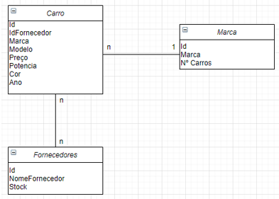

<h1>Programação Web</h1>
Trabalho nº2. Parte 1
Grupo 1

Proposta de trabalho: Criação de stand automóvel.

Tabelas: Marca, Carro, Fornecedor, Cliente, Lista de preferências.

Atributos: Neste projeto criamos as seguintes tabelas que se interligam da seguinte forma.

A tabela Cliente que contem (id, Nome, Contacto e Nif), esta tabela estabelece uma relação de cardinalidade (1:1) com a tabela Lista de preferências. Utilizamos o Id como chave primaria.

A tabela Lista de preferências contém (Id, Categoria e Preço), esta tabela guarda a lista de preferências do cliente e estabelece uma ligação de cardinalidade (1:n) com a tabela carro, visto que poderá haver vários carros que correspondem às preferências do cliente. Utilizamos a categoria e o preço como chaves estrangeiras na tabela Lista de preferências. Utilizamos o Id como chave primaria.

A tabela Carro que contem (Id, Categoria, Marca, Modelo, Preço, Potencia, Cor, Ano), estabelece uma relação de cardinalidade (n:1) com a tabela marca, já que existem vários carros de uma só marca. Utilizamos a Marca como chave estrangeira. Utilizamos o Id como chave primaria.

A tabela Marca que contem (Id, IdFornecedor, Marca, NºCarros) estabelece uma ligação de cardinalidade (m:n) com a tabela Fornecedores, visto que muitos fornecedores vendem muitas marcas. Utilizamos IdFornecedor como chave estrangeira. Utilizamos o Id como chave primaria.

A tabela Fornecedores contém (Id, NomeFornecedor e Stock). Utilizamos o Id como chave primaria.

Cardinalidade (m:n): Vários Fornecedores para vários carros. Vários veículos podem estar em várias listas de preferência.

Cardinalidade (n:1): Vários Carros para uma Marca. 

Cardinalidade (1:1): Uma lista de preferências para um cliente.

Recursos/Métodos Marca: Criar, ler, atualizar e apagar.

Recursos/Métodos Carro: Criar, ler, atualizar e apagar.

Recursos/Métodos Fornecedor: Criar, ler, atualizar e apagar.

Recursos/Métodos Clientes: Criar, ler, atualizar e apagar.

Recursos/Métodos Lista de preferências: Criar, ler, atualizar e apagar. 

