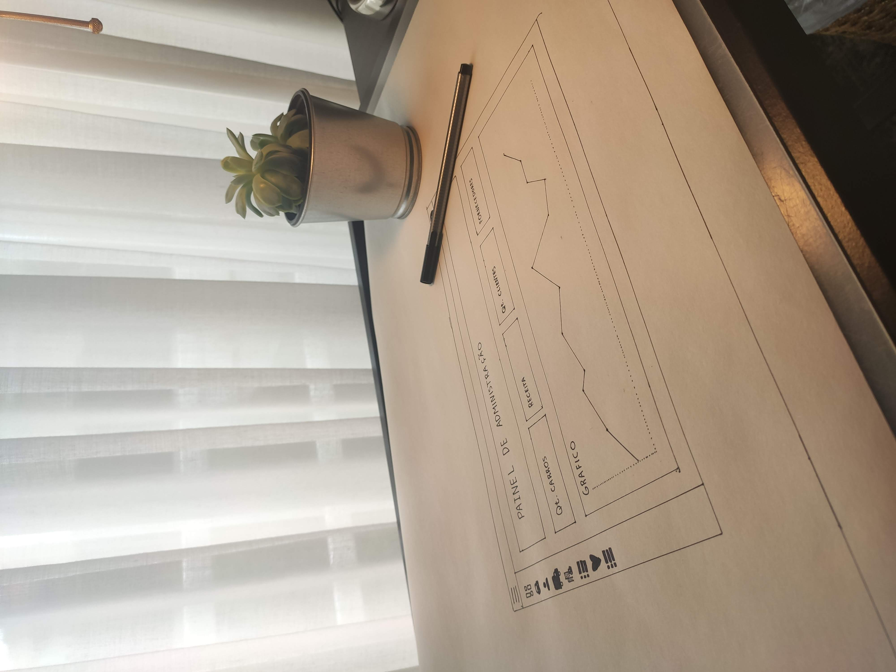
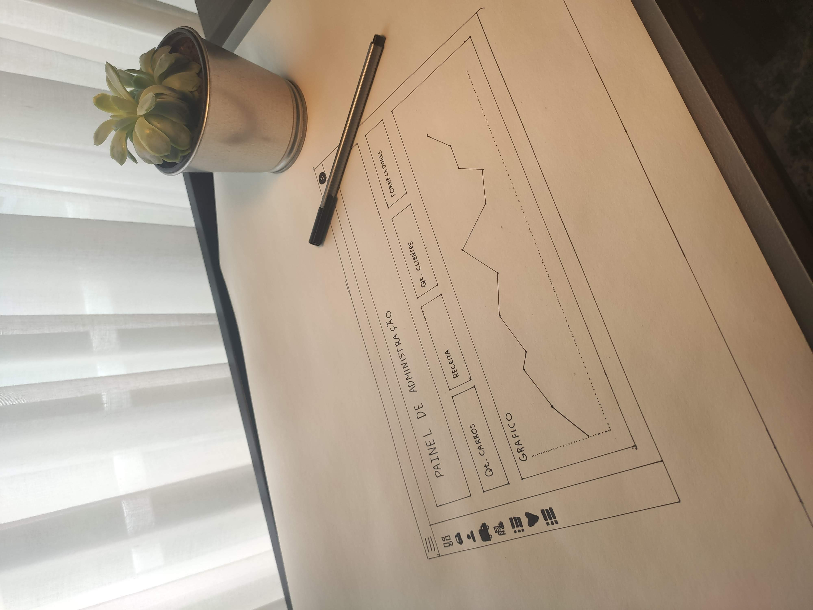
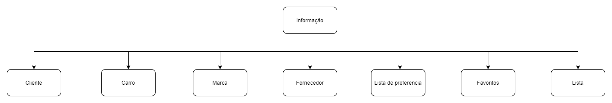

# C2 : User Interface

Neste capitulo vamos apresentar o processo de criação do User Interface.

### Sketchs

Sketchs iniciais

 | 

### Informação que pretendemos mostrar

| |
:---:

Neste diagrama estão descritas as tabelas que pretendemos adicionar ao nosso website.|

---
[< Previous](c1.md) | [^ Main](https://github.com/exemploTrabalho/report) | [Next >](c3.md)
:--- | :---: | ---: 
